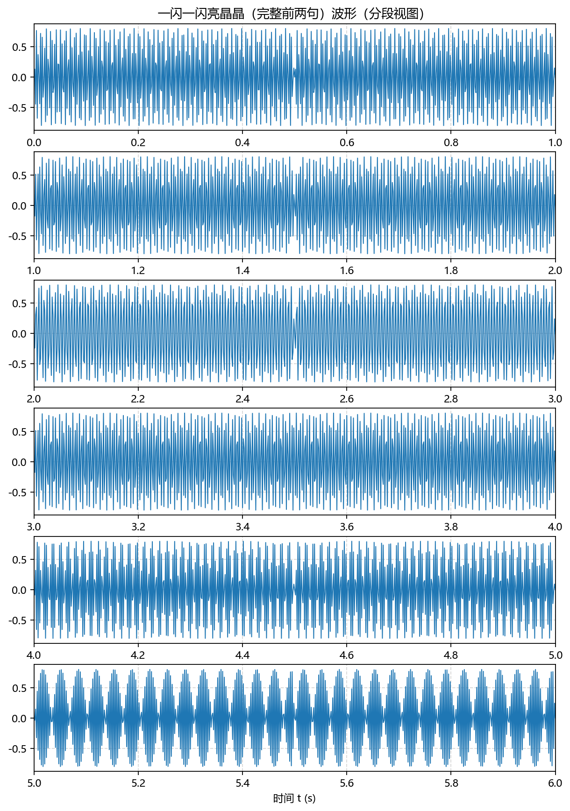

# Signals and Systems Homework（信号与系统作业仓库）

本仓库用于存放“信号与系统”课程作业及其可复现实验代码、图像与音频产物。所有作业均尽量做到：
- 代码可直接运行（推荐使用 uv 管理 Python 环境）
- 产出明确、可复现（将关键图片和音频也纳入仓库便于查阅）
- 简洁清晰的 README 指南

---

## 目录结构
```
homework01/
  ├─ c1_sampling_and_tones.py      # 作业核心脚本：采样演示 + 简易乐音合成
  ├─ requirements.txt              # 运行所需依赖（numpy, matplotlib）
  ├─ README.md                     # homework01 的局部说明
  └─ outputs/
      ├─ images/                   # 所有图片输出
      │   ├─ sampling_f10.0_fs*.png
      │   ├─ tone_do_waveform.png
      │   ├─ twinkle_waveform.png
      │   └─ wave_tone_*.png      # C4..B4 七个音的波形
      └─ audio/                    # 所有音频输出（统一 44.1 kHz）
          ├─ tone_do.wav
          └─ twinkle_demo.wav     # 完整“一闪一闪亮晶晶”
```

---

## 快速开始（Windows + PowerShell）
推荐使用 uv（更快更稳定）：

```powershell
# 进入仓库根目录
uv venv .venv ; uv pip install -r homework01\requirements.txt
uv run python homework01\c1_sampling_and_tones.py --no-show --no-sound
```

- 去掉 `--no-show` 可弹出图形窗口；去掉 `--no-sound` 可尝试播放声音
- 未安装 simpleaudio 也没关系，脚本会保存 WAV 至 `homework01/outputs/audio/`（Windows 下可直接双击播放）

如未使用 uv，也可直接使用已激活的 venv/pip：

```powershell
python homework01\c1_sampling_and_tones.py --no-show --no-sound
```

---

## Homework 01 概览
- 题目 C1：正弦信号的抽样
  - 连续信号 x1(t)=sin(2πft)，f=10 Hz
  - 采样频率 fs∈{40,20,30,50} Hz，时间 0~0.2 s
  - 在同一张图中 plot 连续曲线 + stem 离散样本，保存于 `outputs/images/sampling_f10.0_fs*.png`
  - 结论：fs>2f 可避免混叠；fs=2f 为极限，工程上应留冗余（≥2.2f）
- 选做：简易乐音合成
  - 直接以 44.1 kHz 合成与保存
  - 中音 Do（C4≈261.63 Hz）1 s 单音：`outputs/audio/tone_do.wav`
  - 完整“一闪一闪亮晶晶”（前两句）：`outputs/audio/twinkle_demo.wav`（每拍 0.5 s）
  - 对应波形图：`outputs/images/twinkle_waveform.png`（分段视图、带下采样，便于观察）
  - 另外生成 C4..B4 七个音的 1 s 波形图：`outputs/images/wave_tone_*.png`

预览示例：



---

## 说明与提示
- 字体：脚本内置中文字体优先级（Microsoft YaHei / SimHei / Arial Unicode MS / Noto Sans CJK SC），避免“豆腐块”；必要时请在本机安装任一中文字体
- 音频：统一导出 44.1 kHz 16-bit PCM WAV，通用播放器均可播放
- 复现：重新运行脚本会覆盖 `outputs/` 下的同名文件

---

## 后续规划
- homework02/…：待补充
- 欢迎提出改进建议或提交 PR
